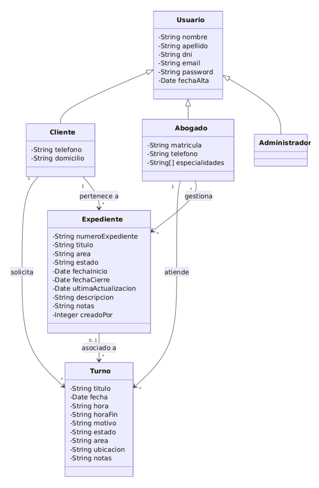

# Minuta de Relevamiento

**Proyecto:** Legal Manager (Sistema de Gestión para Estudio Jurídico)
**Fecha:** 18 de Agosto de 2026
**Equipo de Desarrollo:** Agustín Angelini, Franco Cuscianna, Thiago Cuscianna

## 1. Temática de la Aplicación

El proyecto consiste en el desarrollo de un sistema informático orientado a la administración y gestión operativa de un estudio jurídico. El objetivo principal de la aplicación es digitalizar y centralizar la información de los casos legales (expedientes) y optimizar la agenda de los profesionales mediante un sistema de turnos interactivo. La plataforma servirá como un nexo de comunicación estructurado entre los abogados del estudio y sus respectivos clientes, garantizando la seguridad en el acceso a la información según el rol de cada usuario.

## 2. Roles de Usuario Identificados

El sistema contará con autenticación (basada en JWT) y control de acceso estructurado en tres roles principales:

- **Administrador del sistema (Admin):** Encargado de la configuración general y la administración del personal y usuarios.
- **Abogado:** Profesional del estudio encargado de llevar adelante los casos y atender las consultas.
- **Cliente:** Usuario final que requiere los servicios legales del estudio y necesita dar seguimiento a su situación.

## 3. Funcionalidades Principales (Alcance del Sistema)

A continuación, se detallan las funcionalidades con las que debe cumplir el sistema, categorizadas por módulo o actor:

### A. Módulo de Gestión de Usuarios (Admin)

- **Administración (CRUD):** El administrador deberá poder crear, leer, actualizar y dar de baja cuentas de usuario mediante baja lógica (desactivación), sin eliminarlas de forma permanente.
- **Registro por tipo de cuenta:** El sistema permite registrar usuarios como Administradores, Abogados o Clientes según el tipo de cuenta creada, restringiendo sus vistas y permisos en el sistema de acuerdo al tipo correspondiente.

### B. Módulo de Gestión de Expedientes (Casos Legales)

- **Seguimiento de Casos:** El sistema debe permitir el registro (Alta, Baja y Modificación) de los expedientes legales.
- **Vinculación:** Cada expediente debe estar obligatoriamente vinculado a uno o más Abogados que lo gestionan, y a un Cliente al que le pertenece.
- **Portal del cliente:** Los clientes deberán tener una vista exclusiva donde puedan consultar el estado actual y seguimiento de sus casos activos.
- **Panel del abogado:** Los abogados deberán poder listar, revisar y actualizar el estado de los múltiples expedientes que tengan asignados.

### C. Módulo de Agenda y Turnos

- **Calendario interactivo:** La aplicación deberá incluir una interfaz de calendario dinámica para la gestión visual de las citas.
- **Solicitud de turnos:** El sistema debe permitir a los clientes solicitar turnos con los abogados por diversos motivos.
- **Gestión de agenda:** Los abogados deberán poder visualizar su calendario de turnos asignados, gestionar su disponibilidad y hacer seguimiento de sus próximas citas.

### D. Funcionalidades Transversales (UX/UI y Seguridad)

- **Control de acceso:** Login seguro para todos los usuarios.
- **Accesibilidad visual:** Inclusión de un interruptor para alternar la interfaz entre "Modo Claro" y "Modo Oscuro" (Light/Dark Theme), mejorando la experiencia de uso.

## 4. Reglas de Negocio

### A. Estados y ciclo de vida

- **Estados del expediente:** activo, pendiente, cerrado. Al cerrar un expediente se registra su fecha de cierre. Un expediente cerrado no puede modificarse ni reabrirse.
- **Estados del turno:** pendiente, confirmado, cancelado. Un turno confirmado cuya fecha y hora ya transcurrieron se considera finalizado.
- **Baja lógica:** ninguna entidad se elimina de forma física; únicamente se desactiva y deja de visualizarse.

### B. Vinculaciones

- Cada expediente debe estar vinculado a al menos un abogado y a un único cliente.
- Un turno puede asociarse a un expediente de forma opcional (0..1).
- El expediente es creado por un abogado (o el administrador), que asigna el cliente y al menos un abogado responsable.
- Un cliente puede no tener expedientes ni abogados vinculados hasta que se cree su primer expediente o turno.
- Un abogado solo puede gestionar expedientes y turnos de los clientes que están vinculados a él mediante los expedientes que gestiona.

### C. Agenda y turnos

- **Conflicto de agenda:** un abogado no puede tener más de un turno en el mismo día y franja horaria.
- El abogado puede agendar turnos en nombre de sus clientes.
- Un turno asociado a un expediente hereda su área; sin expediente, registra su propia área.

### D. Roles y registración

- Solo los clientes se registran de forma autónoma. Los abogados son creados por el administrador y el administrador por el sistema.
- El rol de un usuario es fijo e inmutable: no puede cambiarse (ej. de cliente a abogado).
- El administrador puede crear y dar de baja otros administradores, excepto darse de baja a sí mismo.

### E. Datos

- La descripción del expediente es obligatoria; las notas son opcionales.
- El abogado registra su teléfono, visible para sus clientes.
- El cliente registra su domicilio y teléfono (opcionales) para notificaciones y contactos.

## 5. Matriz de Permisos

| Funcionalidad | Administrador | Abogado | Cliente |
|---|---|---|---|
| Gestión de Usuarios (CRUD) | Sí | No | No |
| Crear/actualizar expedientes | Sí | Sí | No |
| Cambiar estado de expediente | Sí | Solo los que gestiona | No |
| Consultar expedientes | Sí | Solo los que gestiona | Solo propios |
| Solicitar turnos | Sí | Sí, de sus clientes | Sí |
| Gestionar turnos (Confirmar/Cancelar/Reprogramar) | Sí | Sí, de sus clientes | Solo propios |
| Consultar agenda | Sí | Su calendario | Solo propios |

## 6. Anexo: Diagrama de Clases Conceptual

Como respaldo al relevamiento, se presenta el modelo conceptual de dominio sin componentes de bases de datos ni métodos, reflejando las entidades y relaciones detectadas en las funcionalidades requeridas.

